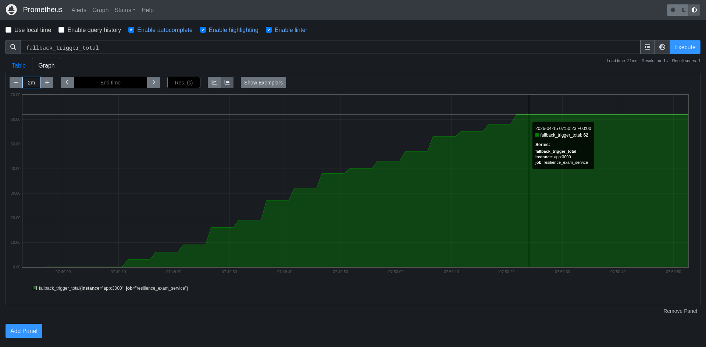

# ResilienceExam

## Component: `src/app.ts` and `src/server.ts`

**Purpose:**

- Implements a resilient `/todos` route with **primary** (`jsonplaceholder`) + **fallback** (`dummyjson`) API calls.
- Supports an intentional failure toggle (`?failPrimary=true`) to force fallback behavior for demos/testing.
- Emits a Prometheus Counter `fallback_trigger_total` and exposes metrics at `/metrics`.
- Produces structured JSON logs whenever fallback is triggered.

**Execution:**

1. Install dependencies:
   ```bash
   npm install
   ```
2. Start the service:
   ```bash
   npm start
   ```
3. Validate routes:
   - Primary path: `http://localhost:3000/todos`
   - Forced fallback: `http://localhost:3000/todos?failPrimary=true`
   - Metrics: `http://localhost:3000/metrics`

## Component: `prometheus.yml`

**Purpose:**

- Configures Prometheus to scrape this service every 5 seconds from `app:3000/metrics`.

**Execution:**

- Used automatically by Docker Compose for local observability setup.

## Component: `docker-compose.yml`

**Purpose:**

- Spins up two containers:
  - `app`: Node.js service
  - `prometheus`: Prometheus server with mounted config
- Enables local metric visualization in Prometheus UI.

**Execution:**

1. Run both services:
   ```bash
   docker compose up --build
   ```
2. Open Prometheus UI:
   - `http://localhost:9090`
3. In **Expression**, enter:
   ```text
   fallback_trigger_total
   ```
4. Click **Execute** then switch to **Graph** view.

## Prometheus graph



## How to generate fallback spikes and take a screenshot

1. Ensure stack is running (`docker compose up --build`).
2. Trigger fallback multiple times:
   ```bash
   curl "http://localhost:3000/todos?failPrimary=true"
   curl "http://localhost:3000/todos?failPrimary=true"
   curl "http://localhost:3000/todos?failPrimary=true"
   ```
3. Wait ~5-10 seconds for a scrape cycle.
4. Refresh query `fallback_trigger_total` in Prometheus (`http://localhost:9090`).
5. Open **Graph** tab and capture a screenshot showing the increasing counter line.

## Random staggered curl load (for graph patterns)

Run a random burst/jitter traffic script to create a less uniform chart shape:

```bash
bash scripts/randomized_load.sh
```

You can tune behavior via env vars:

```bash
BASE_URL=http://localhost:3000 \
ROUNDS=80 \
MAX_BURST=6 \
MIN_DELAY_MS=150 \
MAX_DELAY_MS=3000 \
FAIL_PROBABILITY=75 \
bash scripts/randomized_load.sh
```

- `FAIL_PROBABILITY`: percent of requests that force fallback via `?failPrimary=true`
- `ROUNDS` x random burst size controls total request volume
- delay jitter between rounds helps produce a random-ish graph shape

## Tests

Run focused tests for fallback and metric behavior:

```bash
npm test
```
